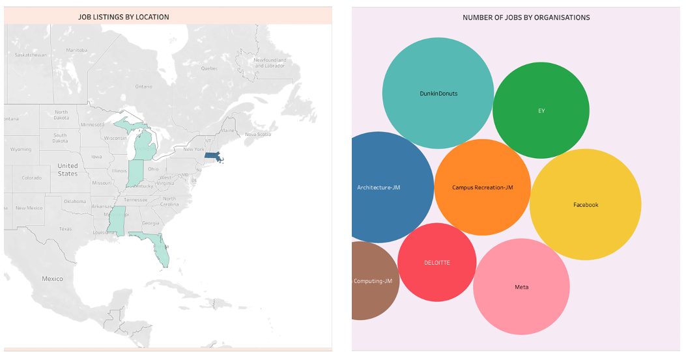
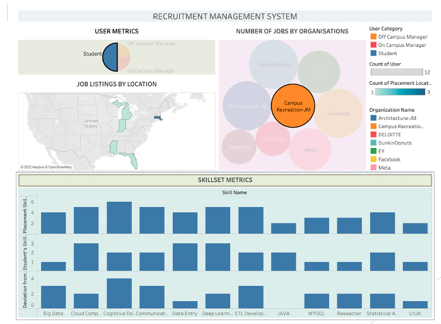

# Campus Recruitment Management System

## Project Overview
The **Campus Recruitment Management System** is designed to streamline the recruitment process for universities with large student populations, accommodating both on-campus and off-campus opportunities. This centralized system supports students, employers, professors, and university administrators, aiming to facilitate efficient connections between job-seeking students and hiring organizations. It addresses the challenge of managing diverse job listings and skill requirements across various employment types within a single platform.

## Table of Contents
1. [Business Problem Statement](#business-problem-statement)
2. [Proposed Solution](#proposed-solution)
3. [Database Design and Entities](#database-design-and-entities)
4. [Installation](#installation)
5. [Usage](#usage)
6. [Contributing](#contributing)
7. [License](#license)

## Business Problem Statement
With approximately 20,000 students attending, the university faces challenges in coordinating and managing both on-campus and off-campus employment opportunities. The lack of a centralized infrastructure complicates the connection between students and employers. This system intends to provide a unified approach, handling various roles and job postings including co-ops, full-time positions, and university clerical and service roles.

## Proposed Solution
The **Campus Recruitment Management System** is a comprehensive database system that consolidates all recruitment processes for on-campus and off-campus job opportunities. This system enables:
- Centralized access to job listings for students.
- Secure and efficient job search processes.
- A focus on student skill development and job application preparedness.

## Database Design and Entities
The system’s database structure supports various interconnected entities to facilitate recruitment processes. Key entities include:

1. **Login Portal**: Stores information related to users (Students and Hiring Managers) and connects with user profiles and feedback.
2. **Login Category**: Differentiates user types within the system.
3. **Student Profile**: Contains demographic and educational information on students, linked to their application and skillset data.
4. **Placement Application**: Tracks the job applications submitted by students.
5. **Placement Listing**: Contains information about job opportunities, linking skills and placement type details.
6. **Placement Type**: Defines the nature of the job (on-campus or off-campus) and job titles.
7. **Organization**: Stores hiring organization information and collects feedback from students.
8. **Organization Feedback**: Collects and stores feedback about the organization from students.
9. **Placement Skillset**: Lists skills required for each job posting.
10. **Student Skillset**: Records the skillsets of individual students.
11. **Student Work Experience**: Maintains employment history for students.
12. **Student Education**: Contains academic details of students.

## Installation
To install and set up the project, follow these steps:

1. Clone this repository:
   ```bash
   git clone https://github.com/your-username/campus-recruitment-management.git
## Visualisations


